# Fix: Lot Coverage Building Footprint Calculation

## Problem Statement

The [`_run_lot_coverage_audit()`](main_mcp.py:830) method calculates the building footprint by **summing ALL floor elements** across all levels. For lot coverage, the correct building footprint is the **largest total area on a single level** (i.e., the maximum floor plate area).

### Current (Wrong) Behavior

```
Floor elements found:
  - NR TJI12 R-0  (FP2.ADU level)   = 720.00 sq ft
  - Concrete - 4" (FP1.GARAGE level) = 669.78 sq ft
  - NR 2x10 R-0   (FP2.ADU level)   = 138.25 sq ft
  ------------------------------------------------
  Sum (all floors): 1,528.03 sq ft  ← WRONG for lot coverage
```

### Correct Behavior

```
Grouped by level:
  FP2.ADU level:    720.00 + 138.25 = 858.25 sq ft  ← MAX LEVEL
  FP1.GARAGE level: 669.78          = 669.78 sq ft

Building footprint (max level area): 858.25 sq ft  ← CORRECT
```

## Root Cause

In the `get_category_area` inner function within [`_run_lot_coverage_audit()`](main_mcp.py:856), the code extracts `Area` and `Name` parameters from floor elements but **does not extract the `Level` parameter**. It simply accumulates:

```python
total_sqft += area_float  # line 933 — sums ALL floors unconditionally
```

## Affected Code Location

[`main_mcp.py`](main_mcp.py:830-990) — specifically lines 941-945 and the `get_category_area` inner function at lines 856-939.

## Data Flow

```mermaid
flowchart TD
    subgraph "Current (Wrong)"
        A["query_model OST_Floors"] --> B["get_element_data<br/>returns Floor elements"]
        B --> C["Extract Area for each floor<br/>NO Level extraction"]
        C --> D["Sum ALL floor areas<br/>total_sqft += area_float"]
        D --> E["Building Footprint = 1,528 sq ft<br/>INCORRECT for lot coverage"]
    end

    subgraph "Proposed (Correct)"
        F["query_model OST_Floors"] --> G["get_element_data<br/>returns Floor elements"]
        G --> H["Extract Area + Level<br/>for each floor element"]
        H --> I["Group by Level Name"]
        I --> J["Find max level area<br/>max_level_sqft = max per-level sum"]
        J --> K["Building Footprint = 858 sq ft<br/>CORRECT for lot coverage"]
    end

    style E fill:#f88,color:black
    style K fill:#4CAF50,color:white
```



## Proposed Changes

### Change 1: Add `Level` parameter extraction in `get_category_area`

In the `get_category_area` inner function, add a `LEVEL_KEYS` list and extract the level name alongside area and name for each element.

**Location:** [`main_mcp.py`](main_mcp.py:887-897), where `AREA_KEYS` and `NAME_KEYS` are defined.

```python
# Add this alongside existing key lists:
LEVEL_KEYS = ["Level", "level", "LEVEL_PARAM"]
```

Then in the element parsing loop (around line 922-936), extract level:

```python
level_val = _pick(params, LEVEL_KEYS) or "Unknown Level"
```

And include it in `elements_info`:

```python
elements_info.append({
    "name": name_val,
    "area_sqft": area_float,
    "level": level_val,       # NEW
})
```

### Change 2: Group floors by level and take max

After calling `get_category_area("OST_Floors")` at line 942, instead of using `floor_sqft` directly, group the `floor_details` by level and compute the max.

**Location:** [`main_mcp.py`](main_mcp.py:941-944)

Replace:
```python
floor_sqft, floor_details = await get_category_area("OST_Floors")
```

With logic that:
1. Groups `floor_details` by `level` key
2. Sums areas per level
3. Takes the maximum level sum as the building footprint
4. Preserves detailed per-element info for reporting

```python
# Get floor elements with level info
_, floor_details = await get_category_area("OST_Floors")

# Group by level and find the max level area (building footprint)
from collections import defaultdict
level_groups = defaultdict(list)
for fd in floor_details:
    level_groups[fd.get("level", "Unknown")].append(fd)

max_level_name = ""
max_level_area = 0.0
for lv_name, elements in level_groups.items():
    lv_total = sum(e.get("area_sqft", 0) for e in elements)
    if lv_total > max_level_area:
        max_level_area = lv_total
        max_level_name = lv_name

floor_sqft = max_level_area  # ← building footprint = max level area
```

### Change 3: Update narrative to explain per-level grouping

Update the narrative output (around line 952-968) to explain that the building footprint represents the largest floor plate area, not the sum of all floors.

### Change 4 (Optional): Update tool description

Update the `axo_audit_lot_coverage` tool description at [line 192](main_mcp.py:192) to clarify that building footprint = largest single-level floor area.

## Verification

After the fix, with the user's test data, the result should be:

| Metric | Current (Wrong) | Correct (After Fix) |
|---|---|---|
| Lot Area | 18,975.88 sq ft | 18,975.88 sq ft |
| Building Footprint | 1,528.03 sq ft (sum of all floors) | **858.25 sq ft** (FP2.ADU level) |
| Lot Coverage | 8.05% | **4.52%** |

## Implementation Checklist

- [ ] Add `LEVEL_KEYS` lookup list in `get_category_area` inner function
- [ ] Extract `level` from each floor element's parameters
- [ ] Include `level` in `elements_info` dictionary
- [ ] Group floor details by level after `get_category_area` returns
- [ ] Compute `max_level_area` as the building footprint
- [ ] Update narrative to reflect per-level grouping logic
- [ ] Verify corrected output matches expected 858.25 sq ft / 4.52%
