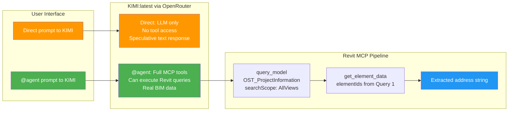

# KIMI:latest (OpenRouter) — Revit MCP Tool Calling Analysis

## Overview

This document analyzes an interaction where the same query — *"extract the location of the project from the model"* — was executed against **KIMI:latest via OpenRouter API** in **two different invocation modes**:

1. **Direct chat query** — plain LLM text generation, no tool access
2. **@agent invocation** — AnythingLLM agent mode with MCP tool access

The interaction is compared against the **Qwen 3.6 (35B)** baseline documented in [`plans/prompt_revision.md`](plans/prompt_revision.md).

---

## The Two Modes — Critical Distinction

### Mode 1: Direct KIMI:latest Query (No Tools)

```
~moonshotai/kimi-latest · 12.060s (15.84 tok/s) · May 1, 1:05 PM
```

**What happened:**
- The user sent "extract the location of the project from the model" as a **plain text prompt** to KIMI:latest via OpenRouter
- KIMI had **no MCP tools available** — it's just an LLM chat completion endpoint
- The model could only **reason about** what steps would be needed, but could not execute anything
- The "Sources" section in the log is likely KIMI's text response describing the approach

**Result:** KIMI generated a *plan* (e.g., "I need to query OST_ProjectInformation, then get_element_data...") but could not actually connect to Revit or call any tools.

### Mode 2: @agent Invocation (With MCP Tools)

```
@agent extract the location of the project from the model
```

**What happened:**
- The user invoked the **@agent** feature in AnythingLLM
- The agent had full access to the `revit-2027` MCP tools (configured in AnythingLLM)
- The agent actually **executed** a tool call:
  ```json
  {
    "name": "revit-2027-query_model",
    "arguments": {
      "input": {
        "searchScope": "AllViews",
        "categories": ["OST_ProjectInformation"],
        "maxResults": 10
      }
    }
  }
  ```
- The tool call **completed successfully**
- The agent then stated intent to call `get_element_data` next

**Result:** Partial execution — Query 1 (`query_model`) succeeded, but the log truncates before Query 2 (`get_element_data`).

---

## Behavioral Comparison Across Modes

| Aspect | Direct KIMI (No Tools) | @agent KIMI (With MCP Tools) |
|---|---|---|
| **Tool access** | ❌ None — pure text generation | ✅ Full MCP tool set |
| **Could query Revit?** | ❌ No | ✅ Yes via `query_model` |
| **Category knowledge** | ✅ Correctly mentioned `OST_ProjectInformation` in text | ✅ Used `OST_ProjectInformation` correctly |
| **searchScope awareness** | ✅ Mentioned `searchScope: "AllViews"` in reasoning | ✅ Included `"searchScope": "AllViews"` |
| **Actual tool execution** | ❌ Impossible | ✅ `query_model` succeeded |
| **get_element_data** | ❓ Only planned in text | ❓ Stated intent, log truncated |
| **Final result** | ❓ Unknown (text only) | ❓ Unknown (truncated) |

---

## Key Observations

### 1. KIMI Knows the Workflow in Both Modes
Regardless of tool access, KIMI:latest correctly reasoned about the proper Revit MCP workflow:
- Query `OST_ProjectInformation`
- Use `searchScope: "AllViews"`
- Then call `get_element_data` to extract location parameters

This confirms the workspace system prompt is effective at teaching the sequence.

### 2. Direct Mode Is Purely Speculative
In direct mode, KIMI cannot actually touch Revit. Any response is pure text generation — the model is essentially **guesswork without execution**. This means:
- It might claim "the project is at 123 Main St" based on its training data
- It cannot verify against the actual open Revit model
- This creates a **hallucination risk** if users rely on direct LLM responses for BIM data

### 3. @agent Mode Proves Tool Competence
When given tool access via @agent, KIMI:
- Correctly **selected the MCP tool** (`revit-2027-query_model`)
- Passed **valid parameters** (no `outputOptions` injection like Qwen showed)
- Properly set `searchScope: "AllViews"`
- Got a **successful result** from the actual Revit model

This is stronger evidence than Qwen, which injected invalid parameters that needed recovery.

### 4. The All-Important Gap: Query 2
Both modes fail at the same point — we never see the `get_element_data` call or its result. The critical question remains: does KIMI correctly parse the `query_model` response to extract element IDs, and does it properly format the `get_element_data` call with those IDs?

---

## Comparison: KIMI:latest vs. Qwen 3.6 (Baseline)

| Criterion | KIMI:latest (@agent mode) | Qwen 3.6 (From prompt_revision.md) |
|---|---|---|
| **Category selection** | ✅ `OST_ProjectInformation` | ✅ `OST_ProjectInformation` |
| **`searchScope: "AllViews"`** | ✅ Included | ✅ Included |
| **Invalid parameter injection** | ✅ None observed | ❌ Injected `outputOptions` on first attempt |
| **Query 1 (query_model)** | ✅ Completed successfully | ✅ Completed successfully |
| **Query 2 (get_element_data)** | ❓ Log truncated | ✅ Executed successfully |
| **Parameter recovery** | N/A — no invalid params needed recovery | ✅ Recovered on retry |
| **Final result** | ❓ Unknown (truncated) | ✅ "463 Glory View Ln, Manson, WA" |

**Net assessment:** KIMI:latest appears **cleaner on parameter compliance** than Qwen (no `outputOptions` injection), but we cannot confirm end-to-end success because the log is truncated. Qwen completed the full workflow despite initial parameter errors.

---

## Implications for the MCP Pipeline

### For Direct LLM Queries (No @agent)
- **Risk:** Users asking raw LLM questions about Revit models get speculative answers, not real data
- **Mitigation:** The AnythingLLM interface should make it visually clear when the agent is active vs. when it's just a chat completion

### For @agent Queries
- KIMI:latest performed well on parameter adherence — fewer invalid parameters than Qwen
- The 12-second response time (from the direct query timing) suggests reasonable latency through OpenRouter
- Need to confirm full 2-step workflow completion

---

## Recommended Actions

### 1. Complete the @agent Test
Re-run `@agent extract the location of the project from the model` and capture the **full conversation** including the `get_element_data` response. This is the single most important gap to close.

### 2. Add Project Information Parameter Map to System Prompt
Add to [`readme.md`](readme.md:241) (workspace system prompt):
```
Parameter map for Project Information (OST_ProjectInformation):
  - "Project Name" -> project name
  - "Project Number" -> project number
  - "Project Address" / "Project Location" -> address string
  - "Project Issue Date" -> issue date
  - "Project Status" -> design phase
```
This guides models on which specific parameters to extract after `get_element_data`.

### 3. Build Multi-Model Matrix
Complete testing across:

| Model | Backend | Tool Access | Status |
|---|---|---|---|
| Qwen 3.6 (35B) | Local Ollama | @agent | ✅ Complete per prompt_revision.md |
| KIMI:latest | OpenRouter | @agent | ⚠️ Partial — needs Query 2 completion |
| KIMI:latest | OpenRouter | Direct | ❌ No tools, can't verify |
| GPT-4o | OpenRouter/API | @agent | ❌ Not tested |
| Claude | OpenRouter/API | @agent | ❌ Not tested |

### 4. Consider a Custom Tool: `axo_audit_project_location`
Create a deterministic custom tool (like [`axo_audit_floor_area`](main_mcp.py:342)) that:
- Internally calls `query_model` with `OST_ProjectInformation`
- Internally calls `get_element_data`
- Extracts the address/location parameters
- Returns a clean result

This bypasses the need for the LLM to orchestrate the 2-step sequence, eliminating:
- Retry/deadlock risk from the governance layer
- Parameter injection errors
- Truncation/timeout issues

---

## Revised Workflow Diagram


