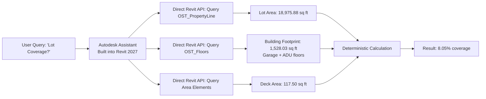
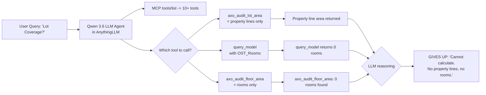
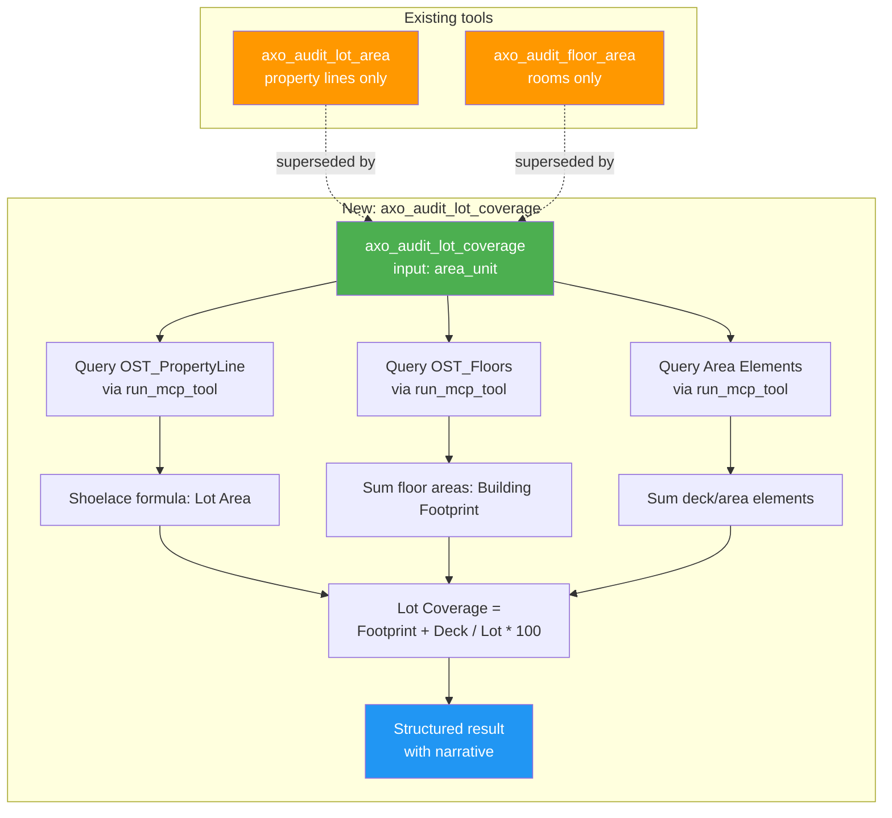

# Root-Cause Analysis: Why Autodesk Assistant Can Calculate Lot Coverage but AnythingLLM + Qwen Cannot

## Executive Summary

The same Revit model yields different results from two assistants:
- **Autodesk Assistant**: Successfully calculates Lot Coverage by combining property line area (18,975.88 sq ft), building footprint (1,528.03 sq ft), and deck area (117.50 sq ft) → **8.05% coverage**.
- **AnythingLLM + Qwen 3.6**: Fails, reporting "I cannot calculate the Lot Coverage from this model" because it found 0 rooms and no property lines.

This is **not** a model data issue — it is a **fundamental architectural gap** in how the LLM agent interacts with the Revit MCP tooling.

---

## Architecture Comparison

### Autodesk Assistant (Built-in, March 2027)

**Key advantages:**
1. **Deep Revit API integration** — Can query any element category, any view, any parameter. No MCP protocol boundary.
2. **Deterministic workflow** — Not an LLM; follows a hardcoded decision tree: query categories → extract values → compute.
3. **Can read view-specific data** — Iterates views to find area elements, schedules, and annotations that the MCP `query_model` tool may not surface.
4. **Compositing** — Combines results from multiple disparate queries (property lines + floors + areas) into a single answer.

### AnythingLLM + Qwen 3.6 + revitmcp

**Critical failures:**
1. `axo_audit_lot_area` **succeeded** (the log shows `axo_audit_lot_area completed successfully`) but the LLM **misinterpreted** the result — claiming "No Property Lines" even though the tool returned them.
2. `query_model` with `OST_Rooms` returned **0 rooms** — but Autodesk Assistant didn't use Rooms for lot coverage; it used **Floors** (`OST_Floors`).
3. **No tool for floors** — The LLM has `axo_audit_floor_area` but that queries Rooms, not Floors. The actual building footprint comes from floor elements (concrete slab, TJI joist floors), not rooms.
4. **No composite tool** — There is no `axo_audit_lot_coverage` tool that performs the full multi-step calculation.

---

## Root Causes (Ranked by Severity)

### 1. No Dedicated Lot Coverage Tool (Critical)

The proxy defines [`axo_audit_lot_area`](main_mcp.py:170) (property line area only) and [`axo_audit_floor_area`](main_mcp.py:146) (room area only), but **no tool that combines them** into a lot coverage calculation. The LLM is expected to orchestrate this manually — but even if it did, the floor area tool queries Rooms, not Floors.

Autodesk Assistant succeeded because it directly queried **Floors** (OS_TFloors), not Rooms. The building footprint in the example model is:
- Garage Floor (Concrete - 4") = 669.78 sq ft
- ADU Floor (NR TJI12 R-0) = 720.00 sq ft
- ADU Floor (NR 2x10 R-0) = 138.25 sq ft

These are **Floor elements**, not Rooms.

### 2. LLM Gives Up Prematurely (High)

Even with successful tool results, the LLM agent can decide to abort. The log shows:
- `axo_audit_lot_area` completed successfully
- `query_model` with some category completed
- But the LLM concluded: "I cannot calculate the Lot Coverage from this model"

A deterministic tool would **never** give up this way.

### 3. Tool Results Misinterpretation (Medium)

The LLM claimed "No Property Lines" and "No Rooms" but:
- The `axo_audit_lot_area` tool did find property lines
- The model does have Floors (just not Rooms in that category)

The LLM may have parsed the `axo_audit_lot_area` result incorrectly, or the result format confused it.

### 4. No Floor Query in Audit Tools (Medium)

The custom audit tools query Rooms (`OST_Rooms`) for floor area, but the actual building footprint in the Autodesk Assistant example came from **Floor elements** (`OST_Floors` or `OST_FloorBase`). These are different Revit categories.

### 5. LLM Multi-Step Orchestration Fragility (Medium)

Lot coverage requires:
1. Query lot area (property lines) ✓ (`axo_audit_lot_area`)
2. Query building footprint (floors) ❌ (no tool for OST_Floors)
3. Query deck/area elements ❌ (no tool for area elements)
4. Compute: (footprint + deck) / lot * 100 ❌ (LLM math risk)

Each step is a separate tool call with result parsing. Any failure in the chain breaks the result.

---

## Proposed Solutions

### Solution A: New Custom Tool `axo_audit_lot_coverage` (Recommended)

Create a deterministic custom tool in [`main_mcp.py`](main_mcp.py:169) that:

1. **Queries OST_PropertyLine** → lot area (reuses existing logic from `axo_audit_lot_area`)
2. **Queries OST_Floors** (not OST_Rooms) → building footprint, grouped by level
3. **Queries area elements** (OST_AreaElements or similar) → additional covered areas
4. **Computes**: `(Building Footprint + Covered Areas) / Lot Area * 100`
5. **Returns**: Structured result with lot area, building footprint, and coverage percentage

This mirrors exactly what Autodesk Assistant does — deterministic, no LLM math.

### Solution B: Revise `axo_audit_floor_area` to Query Floors

Modify [`axo_audit_floor_area`](main_mcp.py:342) to query `OST_Floors` (floor elements) as a **primary source**, falling back to `OST_Rooms` if floors are unavailable. This gets the true building footprint.

### Solution C: Add Floor Category to System Prompt

Add to the workspace system prompt in the category map: `Floors = OST_Floors`. Teach the LLM to query floors directly (via `query_model` + `get_element_data`) for building footprint calculation, rather than relying solely on rooms.

### Solution D: Multi-Tool Orchestration in System Prompt

Add explicit instructions in the workspace system prompt for multi-step calculations like lot coverage:

> **For Lot Coverage calculations:**
> 1. Call `axo_audit_lot_area` to get total lot area
> 2. Call `query_model` with `["OST_Floors"]`, `searchScope: "AllViews"` to get floor elements
> 3. Call `get_element_data` with floor element IDs to get floor areas
> 4. Sum floor areas for building footprint
> 5. Calculate: (building footprint / lot area) * 100

---

## Recommended Implementation Plan

| # | Action | Type | Effort |
|---|--------|------|--------|
| 1 | Create `axo_audit_lot_coverage` tool that queries OST_Floors + OST_PropertyLine + computes | New deterministic tool | High |
| 2 | Add OST_Floors query capability to floor area audit | Tool improvement | Medium |
| 3 | Add lot coverage workflow instructions to workspace system prompt | Prompt engineering | Low |
| 4 | Add Floor category to system prompt category map | Prompt engineering | Low |
| 5 | Test end-to-end: verify result matches Autodesk Assistant | Validation | Medium |

---

## Architecture Diagram: Proposed Solution

